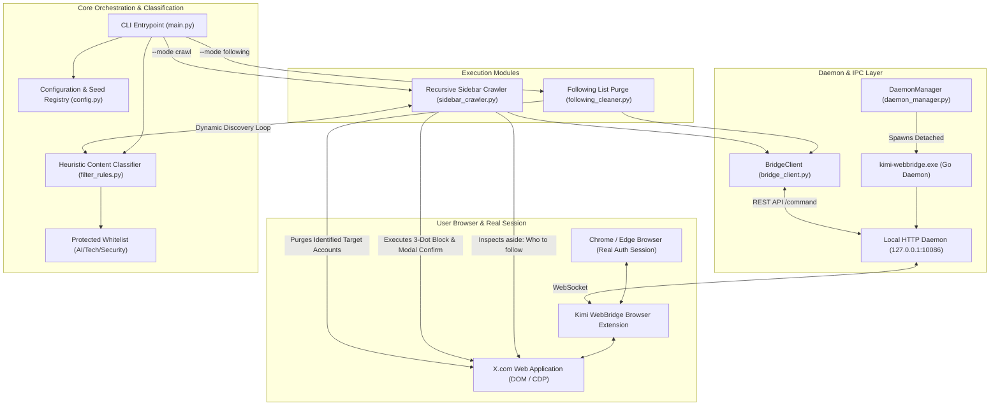
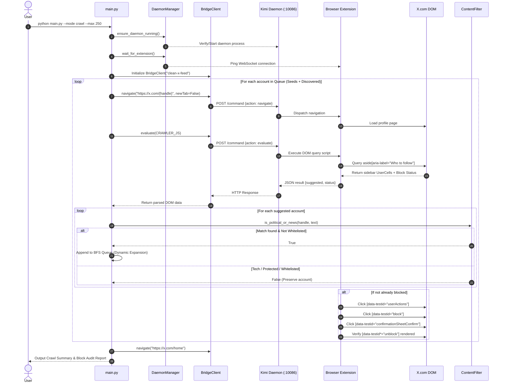

# X Political Content & Journalist Purge Engine

> Autonomous browser-driven agent system to systematically discover, filter, and block Indian political parties (BJP, Congress, regional parties), politicians, state units, subordinate wings, and news media channels from your X (formerly Twitter) feed using Kimi WebBridge.

---

## Table of Contents
- [Overview](#overview)
- [System Architecture Diagram](#system-architecture-diagram)
- [Core Engineering Highlights](#core-engineering-highlights)
- [End-to-End Sequence Flow](#end-to-end-sequence-flow)
- [Graphify Knowledge Graph & Codebase Navigation](#graphify-knowledge-graph--codebase-navigation)
- [Codebase Components](#codebase-components)
- [Getting Started & Usage](#getting-started--usage)
- [Safety & Whitelist Guardrails](#safety--whitelist-guardrails)

---

## Overview

Social media recommendation algorithms frequently saturate feeds with polarized political debates, news television channels, and party propaganda. Unfollowing accounts manually is insufficient because X's recommendation engine continually injects political content via the **"Who to follow" / "You might like"** sidebar, algorithmic suggestions, and trending modules.

This repository provides an automated, browser-integrated solution that:
1. **Audits & Purges Followings**: Identifies all political and media channels in the user's Following list and executes verified blocks.
2. **Crawls the Recommendation Graph (BFS Loop)**: Visits target political profiles (e.g., `@IEhindi`, `@BJP4India`, `@INCIndia`), inspects the `<aside aria-label="Who to follow">` ("You might like") sidebar, parses suggested related entities, classifies them through heuristic filters, and recursively queues their subordinate accounts, leaders, and affiliated channels for blocking.
3. **Protects Safe Domains**: Enforces an unbreachable whitelist preserving AI researchers (`@karpathy`, `@gdb`, `@fchollet`), tech leaders, and cybersecurity specialists.

---

## System Architecture Diagram



---

## Core Engineering Highlights

### 1. Zero-Credential In-Browser Automation via Kimi WebBridge
Traditional API-based bots face aggressive rate limits, high pricing tiers, and lack access to the authentic user feed. Headless Puppeteer/Playwright bots frequently trip Cloudflare, BotGuard, and X bot-detection checkpoints.
* This system connects directly to the user's **real, logged-in browser session** via the local **Kimi WebBridge daemon** on `127.0.0.1:10086`.
* No passwords, session cookies, or API keys are stored or transmitted. The browser extension executes actions with natural human-like dispatch.

### 2. Recursive Sidebar Recommendation Crawler (BFS Discovery Loop)
Political ecosystems on X are heavily clustered. When visiting a party account (e.g., `@BJP4India` or `@INCIndia`), X's recommendation engine in the `<aside aria-label="Who to follow">` ("You might like") sidebar dynamically surfaces:
* Top party office-bearers and spokespersons
* State chapters (`@BJP4Delhi`, `@BJP4UP`, `@INCDelhi`, etc.)
* Youth and student wings (`@BJYM`, `@IYC`, `@NSUI`)
* Friendly regional news outlets and media journalists

Our crawler inspects the recommendation sidebar before blocking each account, applies heuristic classification, extracts novel political handles, and **dynamically appends them to the traversal queue**—creating an autonomous loop that cleans the entire political subgraph.

### 3. Precision Heuristic Classifier & Whitelisting Guardrail
A common pitfall of naive keyword blocking is false-positive filtering (e.g., blocking AI researchers or tech journalists). The engine implements a strict two-layer check:
* **Layer 1: Hardcoded Protected Whitelist**: AI researchers (`@karpathy`, `@gdb`, `@fchollet`, `@sama`, `@ylecun`), tech institutions (`@OpenAI`, `@GoogleAI`, `@huggingface`), and cybersecurity accounts (`@Bugcrowd`, `@intigriti`, `@Hacker0x01`) are never queued or blocked under any circumstance.
* **Layer 2: Comprehensive Political & News Regex**: Scans handles, display names, and bio snippets for political roles (`minister`, `mp`, `mla`, `spokesperson`, `party`, `morcha`, `sevadal`, `sabha`, `yojana`, `cmo`, `pmo`), party acronyms (`bjp`, `inc`, `aap`, `sp`, `tmc`, `ncp`), and news entities (`news`, `express`, `times`, `aajtak`, `abp`, `ndtv`, `ani`, `pti`, `republic`, `zeenews`).

### 4. Resilient Multi-Stage DOM Action Pipeline
X's React-based dynamic UI uses virtualization and asynchronous modals. The injection scripts feature:
* **Pre-check**: Detection of existing blocked state (`[data-testid$="-unblock"]`) to skip redundant operations in milliseconds.
* **Menu Expansion**: Reliable targeting of the `[data-testid="userActions"]` kebab menu with retry backoffs.
* **Sheet Modal Confirmation**: Automated confirmation on `[data-testid="confirmationSheetConfirm"]`.
* **State Verification**: Asserts that the unblock button is rendered before registering a success status.

---

## End-to-End Sequence Flow



---

## Graphify Knowledge Graph & Codebase Navigation

The architecture of this repository has been analyzed and indexed using [graphify](https://github.com/roshan-pixel).

### Graph Metrics
* **Total Nodes**: 44
* **Total Edges**: 52
* **Community Clusters**: 11
* **Extraction Fidelity**: 77% Extracted AST · 23% Inferred Semantic Edges

### Core Abstractions (God Nodes)
| Node | Degree | Role in System |
| :--- | :---: | :--- |
| `BridgeClient` | **12 edges** | Central communication hub interfacing with the WebBridge HTTP daemon. |
| `ContentFilter` | **8 edges** | Cross-community classifier connecting discovery, validation, and queue logic. |
| `main()` | **5 edges** | Orchestration nexus routing CLI arguments into execution pipelines. |

### Visual Interactive Graphs
* **Cluster Overview**: Open `graphify-out/graph.html` in any browser.
* **Hierarchical Tree View**: Open `graphify-out/GRAPH_TREE.html` for collapsible D3 v7 symbol navigation.

### Graph Queries
You can query relationships and shortest execution paths directly:
```bash
# Query architectural paths between components
graphify path "main()" "BridgeClient"

# Plain-language concept explanation
graphify explain "ContentFilter"

# Context-scoped natural language query
graphify query "How does sidebar crawler discover new political entities?"
```

---

## Codebase Components

| File | Purpose |
| :--- | :--- |
| [`main.py`](file:///C:/Users/sgarm/remove-political-content-x-/main.py) | Central CLI entry point with mode switches (`crawl`, `following`, `status`). |
| [`config.py`](file:///C:/Users/sgarm/remove-political-content-x-/config.py) | Configuration constants, seed lists (BJP, Congress, media outlets), and whitelist. |
| [`sidebar_crawler.py`](file:///C:/Users/sgarm/remove-political-content-x-/sidebar_crawler.py) | Recursive BFS crawler scanning the `<aside aria-label="Who to follow">` module. |
| [`following_cleaner.py`](file:///C:/Users/sgarm/remove-political-content-x-/following_cleaner.py) | Scans user following list, isolates political accounts, and purges them. |
| [`filter_rules.py`](file:///C:/Users/sgarm/remove-political-content-x-/filter_rules.py) | Regular expression classifier and whitelist enforcement rules. |
| [`bridge_client.py`](file:///C:/Users/sgarm/remove-political-content-x-/bridge_client.py) | Low-level HTTP/JSON client speaking to Kimi WebBridge daemon (`127.0.0.1:10086`). |
| [`daemon_manager.py`](file:///C:/Users/sgarm/remove-political-content-x-/daemon_manager.py) | Lifecycle supervisor: detaches daemon, checks health, verifies extension sync. |

---

## Getting Started & Usage

### 1. Prerequisites
* Python 3.8+ (Standard Library only; no external pip dependencies needed).
* Google Chrome or Microsoft Edge with the **Kimi WebBridge** extension installed.
* An active, authenticated session on [X.com](https://x.com).

### 2. Installation
```bash
git clone https://github.com/roshan-pixel/remove-political-content-x-.git
cd remove-political-content-x-
```

### 3. Verify Daemon & Extension Status
```bash
python main.py --mode status
```
*Expected Output:*
```
[+] Kimi WebBridge daemon and extension are operational.
```

### 4. Run Recursive Sidebar Crawler
Starts with the seed entities (`@IEhindi`, `@BJP4India`, `@INCIndia`, major media outlets), inspects the sidebar on every profile, dynamically queues suggested political accounts, and blocks them:
```bash
python main.py --mode crawl --max 200
```

### 5. Run Following Purge
Audits and blocks political/news entities within your current following list:
```bash
python main.py --mode following
```

---

## Safety & Whitelist Guardrails

The engine strictly guards technical and educational creators, as well as financial market infrastructure. The following handles are permanently whitelisted in `config.py` and can never be blocked:

```python
PROTECTED_WHITELIST = {
    # AI & Tech
    "karpathy", "gdb", "fchollet", "sama", "ylecun", "elonmusk", "huggingface",
    "OpenAI", "Google", "GoogleAI", "AnthropicAI", "github", "Bugcrowd",
    "hackthebox_eu", "thedawgyg", "stokfredrik", "InsiderPhD", "intigriti",
    "TCMSecurity", "Hacker0x01", "Uber_Comms", "cyberswag_voxel", "ChuanmingLiu",
    "hingeloss", "DrJimFan", "Tesla_AI", "adcock_brett", "akshay_pachaar",
    "axbom", "Techmeme", "KaulAyushman", "TheOndrakGuy", "deepseek_ai",

    # Financial Markets, Stock Exchanges & Central Banking (NEVER BLOCK)
    "bse_sensex", "BSEIndia", "NSEIndia", "RBI", "SEBI_India", "Nifty50",
    "moneycontrolcom", "livemint", "cnbctv18news", "ZerodhaVarsity", "zerodhaonline",
    "Groww", "Upstox"
}
```

---

## License
MIT License. Created for defensive personal productivity and distraction-free social media curation.
